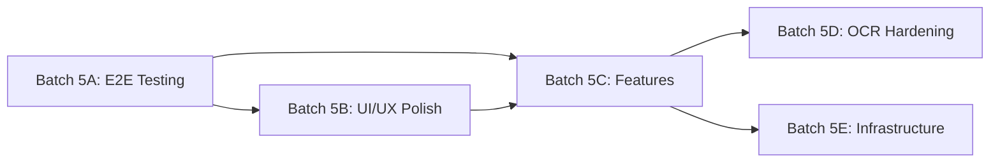

# Phase 5 — Sprint Plan

> **Priority**: QA & Polish (C) → Feature Completion (B) → Production Readiness (A)
> **Start Date**: February 22, 2026
> **Estimated Duration**: 8–10 working days across 5 batches

---

## Batch 5A — E2E Flow Testing & Critical Fixes (P0)

> **Goal**: Verify every real user flow works end-to-end (SuperAdmin → CC → Portal). Fix all broken integrations.
> **Agents**: Frontend + Backend (parallel tracks)
> **Duration**: 2–3 days

### 5A-1: SuperAdmin Flow Verification
**Agent**: Frontend + Backend
- [ ] SA login → Dashboard loads with real tenant stats
- [ ] Create new tenant → appears in list → can edit details
- [ ] Subscription billing dates → expiry check → tenant suspension
- [ ] User management → create user → assign role → verify user can login to CC
- [ ] Fix any broken API calls, missing error handling, or stale mock data

### 5A-2: Control Centre Full Page Walk-Through
**Agent**: Frontend + Backend
- [ ] Login → Dashboard (real data, all cards render)
- [ ] Data Sources → Add → Scan → View results in PII Discovery
- [ ] DSR → Create → View Detail → Approve/Complete flow
- [ ] Consent → Create Widget → View Records → Manage Notices
- [ ] Governance → Purpose Mapping → Policy Manager → Violations → Data Lineage → RoPA
- [ ] Compliance → Departments → Third Parties → Retention → Reports → Nominations
- [ ] Breach → Create Incident → Detail → Status transitions → CERT-In report
- [ ] Audit Logs → Filters working → Export
- [ ] Settings → Profile → basic operations
- [ ] Fix: any page that crashes, shows wrong data, or has broken navigation

### 5A-3: Portal Flow Verification
**Agent**: Frontend + Backend
- [ ] OTP Login → Dashboard loads
- [ ] Profile → Identity verification
- [ ] Consent management → view/toggle purposes
- [ ] Submit DPR request → track status → download result
- [ ] Appeal flow → submit appeal
- [ ] Guardian verification for minors
- [ ] Breach notifications → view list
- [ ] Grievance → submit → track
- [ ] Fix: any broken flow, missing API wiring, stale data

### 5A-4: Cross-System Integration Tests
**Agent**: Backend
- [ ] SA creates tenant → CC user can login under that tenant
- [ ] CC creates DSR → Portal shows it in user's requests
- [ ] CC creates consent widget → public API serves correct config
- [ ] CC logs breach → Portal shows notification
- [ ] All event bus subscribers fire correctly
- [ ] Audit log records all operations

---

## Batch 5B — UI/UX Consistency & Polish (P0)

> **Goal**: Make every page feel production-quality. Consistent loading, error, empty states. Responsive design.
> **Agents**: Frontend (primary) + UX Review
> **Duration**: 2 days

### 5B-1: Loading & Error State Audit
**Agent**: Frontend
- [ ] Every page has a loading spinner/skeleton while fetching data
- [ ] Every page has an error boundary with user-friendly message + retry
- [ ] Every list/table shows an empty state illustration with CTA when no data
- [ ] All forms show field-level validation errors
- [ ] Toast notifications for success/failure on all mutations (create/update/delete)

### 5B-2: Visual Consistency Pass
**Agent**: Frontend
- [ ] All pages use KokonutUI components (no raw HTML inputs, ad-hoc cards)
- [ ] Consistent spacing, padding, border-radius across all 3 apps
- [ ] Sidebar active states, hover effects, section grouping consistent
- [ ] Color palette consistent (no random blues/greens — use design tokens)
- [ ] Typography hierarchy consistent (h1/h2/h3, body, caption)
- [ ] Dark mode check (if partially implemented, either complete or remove)

### 5B-3: Responsive Design
**Agent**: Frontend
- [ ] CC: sidebar collapses on tablet, pages reflow on mobile
- [ ] Portal: fully mobile-responsive (primary use case)
- [ ] Admin: tablet-responsive minimum
- [ ] Tables scroll horizontally on small screens
- [ ] Modals/dialogs work on mobile viewports

### 5B-4: Accessibility Quick Pass
**Agent**: Frontend
- [ ] All interactive elements have focus outlines
- [ ] Forms have proper `<label>` associations
- [ ] Images have alt text
- [ ] Color contrast meets WCAG AA minimum
- [ ] Escape key closes modals

---

## Batch 5C — Feature Completion (P1)

> **Goal**: Close the most impactful remaining feature gaps.
> **Agents**: Backend + Frontend (parallel tracks)
> **Duration**: 2–3 days

### 5C-1: Settings Page Enhancement
**Agent**: Frontend + Backend
- [ ] Profile section: edit name, email, avatar
- [ ] Password change form
- [ ] Notification preferences (email on/off per event type)
- [ ] Tenant configuration: company name, logo, timezone, default language
- [ ] API key management: view, regenerate, revoke

### 5C-2: User Management (CC)
**Agent**: Backend + Frontend
- [ ] Backend: `GET /api/v2/users` (tenant-scoped) — list team members with roles
- [ ] Backend: `POST /api/v2/users/invite` — send invite email with role assignment
- [ ] Backend: `PATCH /api/v2/users/{id}/role` — change user role
- [ ] Backend: `DELETE /api/v2/users/{id}` — deactivate user
- [ ] Backend: Seat limit enforcement (from tenant config, set by SuperAdmin)
- [ ] Frontend: `/users` page — team member list with role badges
- [ ] Frontend: Invite modal — email + role selector, seat count display
- [ ] Frontend: Role change dropdown per user row

### 5C-3: Consent Widget Playground
**Agent**: Frontend
- [ ] `/consent/widgets/:id/preview` — live preview of widget in iframe sandbox
- [ ] Theme customization panel (colors, fonts, border-radius) with live preview
- [ ] Layout switcher (bottom bar, top bar, modal, sidebar, full page)
- [ ] Embed code generator — copy `<script>` tag to clipboard
- [ ] Mobile/desktop preview toggle
- [ ] Purpose toggle testing (simulate consent grant/revoke)

### 5C-4: Nomination Execution
**Agent**: Backend
- [ ] `NOMINATION` DSR type: implement execution path (link nominated guardian to principal)
- [ ] Generate nomination certificate/receipt
- [ ] Portal: nomination status tracking

---

## Batch 5D — OCR & AI Hardening (P1)

> **Goal**: Make OCR work reliably. Tesseract primary, Sarvam Vision as user-triggered fallback.
> **Agents**: AI/ML + Backend
> **Duration**: 1–2 days

### 5D-1: Tesseract Local Setup
**Agent**: AI/ML + DevOps
- [ ] Document Tesseract installation for Windows (choco/scoop/manual)
- [ ] Add Tesseract to Docker image for containerized deployment
- [ ] Verify: upload PDF with embedded text → extract → detect PII
- [ ] Verify: upload scanned image → OCR → extract text → detect PII
- [ ] Handle graceful fallback when Tesseract not installed

### 5D-2: Sarvam Vision Recall Flow
**Agent**: Backend + Frontend
- [ ] After Tesseract processes a document, show results with "Results unsatisfactory?" link
- [ ] On click: trigger Sarvam Vision API re-processing (requires SARVAM_API_KEY)
- [ ] Show comparison: Tesseract result vs Sarvam result
- [ ] User can accept either result
- [ ] Backend: `POST /api/v2/discovery/reprocess/{fieldId}?provider=sarvam`

### 5D-3: File Upload Polish
**Agent**: Frontend
- [ ] Upload progress bar with file size display
- [ ] Supported formats indicator (PDF, DOCX, XLSX, CSV, JPG, PNG)
- [ ] Upload error states (file too large, unsupported format, server error)
- [ ] Post-upload: auto-trigger scan with progress tracking

---

## Batch 5E — Infrastructure & Production Readiness (P2)

> **Goal**: Consolidate migrations, harden Docker deployment, prepare for production.
> **Agents**: DevOps + Backend
> **Duration**: 1–2 days

### 5E-1: Migration Consolidation
**Agent**: Backend + DevOps
- [ ] Audit: map both migration folders (root `migrations/` + `internal/database/migrations/`)
- [ ] Resolve numbering conflicts (duplicate 008, 009, 011, 012)
- [ ] Create single `internal/database/migrations/` as canonical source
- [ ] Update `start-all.ps1` and seed scripts to use canonical path
- [ ] Verify: fresh `docker-compose up` → all migrations apply cleanly

### 5E-2: Docker/Kubernetes Production Config
**Agent**: DevOps
- [ ] `Dockerfile` — multi-stage build (builder → alpine runtime)
- [ ] `docker-compose.prod.yml` — 3 API instances (cc, admin, portal) + nginx + postgres + redis + nats
- [ ] Health check endpoints verified for all modes
- [ ] Environment variable documentation (all required vars, defaults, secrets)
- [ ] Optional: basic K8s manifests (Deployment, Service, ConfigMap, Secret)

### 5E-3: Seed Data & Demo Mode
**Agent**: Backend
- [ ] Comprehensive seed script covering ALL tables (departments, third_parties, ropa, purpose_assignments, reports)
- [ ] "Demo mode" flag: pre-populate with realistic sample data for demonstrations
- [ ] Verify: fresh start → seed → every CC page shows meaningful data

### 5E-4: Environment & Config Audit
**Agent**: Backend + DevOps
- [ ] `.env.example` covers ALL environment variables
- [ ] Missing vars logged as warnings at startup (not crashes)
- [ ] SMTP, AI keys, Sarvam — all gracefully degrade when not configured
- [ ] `start-all.ps1` validates prerequisites before launching

---

## Dependency Map

> **5A must come first** — no point polishing or adding features to broken flows.
> **5B and 5C can partially overlap** after 5A is complete.
> **5D and 5E are independent** and can run in parallel after 5C.

---

## Agent Assignment Summary

| Agent | Batches | Key Responsibilities |
|-------|---------|---------------------|
| **Frontend** | 5A, 5B, 5C, 5D | E2E page testing, UI consistency, widget playground, empty states |
| **Backend** | 5A, 5C, 5D, 5E | Flow fixes, user mgmt API, OCR endpoints, migration cleanup |
| **AI/ML** | 5D | Tesseract setup, Sarvam integration, parsing pipeline |
| **DevOps** | 5D, 5E | Docker hardening, K8s manifests, Tesseract in container |
| **UX Review** | 5B | Visual consistency audit, accessibility check |

---

## Success Criteria for Phase 5

- [ ] Every page in CC, Admin, and Portal loads without errors
- [ ] Complete user journey: SA → create tenant → CC login → scan → DSR → consent → report
- [ ] Portal: OTP login → all features accessible → mobile-friendly
- [ ] All forms validate, all mutations show feedback, all lists handle empty/loading/error
- [ ] `go build`, `go vet`, `npm run build` (all 3 apps) pass
- [ ] Docker Compose: `docker-compose up` → healthy system with seed data
