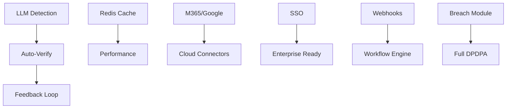

# 17. DataLens 2.0 Feature Roadmap

## Overview

This document outlines the prioritized feature roadmap for DataLens 2.0, organized into quarterly phases with effort estimates and dependencies.

---

## Roadmap Timeline

```
Q1 2026          Q2 2026          Q3 2026          Q4 2026
    │                │                │                │
    ▼                ▼                ▼                ▼
┌────────────┐  ┌────────────┐  ┌────────────┐  ┌────────────┐
│  PHASE 1   │  │  PHASE 2   │  │  PHASE 3   │  │  PHASE 4   │
│            │  │            │  │            │  │            │
│ Foundation │  │ Enterprise │  │ Advanced   │  │ Innovation │
│ & AI Core  │  │ Features   │  │ Compliance │  │ & Scale    │
└────────────┘  └────────────┘  └────────────┘  └────────────┘
```

---

## Phase 1: Foundation & AI Core (Q1 2026)

**Theme**: Transform PII detection with AI and lay the foundation for automation

### P1.1 LLM-Powered Detection Engine

| Task | Effort | Priority |
|------|--------|----------|
| LLM client abstraction (OpenAI/Claude/local) | 2 weeks | P0 |
| Contextual prompt engineering | 1 week | P0 |
| Validation layer integration | 1 week | P0 |
| Confidence calibration | 1 week | P0 |
| Caching layer for LLM results | 1 week | P1 |
| Industry pattern packs (healthcare, finance) | 2 weeks | P1 |

**Deliverable**: 3x improvement in detection accuracy, 50% reduction in false positives

### P1.2 Auto-Verification System

| Task | Effort | Priority |
|------|--------|----------|
| Confidence-based routing logic | 1 week | P0 |
| Auto-verify workflow (>95% confidence) | 1 week | P0 |
| Quick-verify UI (80-95% confidence) | 1 week | P0 |
| Verification analytics dashboard | 1 week | P1 |
| Feedback loop implementation | 2 weeks | P1 |

**Deliverable**: 80% reduction in manual verification work

### P1.3 Performance Foundations

| Task | Effort | Priority |
|------|--------|----------|
| Parallel column scanning | 2 weeks | P0 |
| Redis caching layer | 1 week | P0 |
| Connection pooling optimization | 1 week | P1 |
| Query optimization audit | 1 week | P1 |

**Deliverable**: 5x faster scan times

### P1.4 Purpose Mapping Automation (User Feedback #1) 🎯

| Task | Effort | Priority |
|------|--------|----------|
| Context analysis engine (table/column patterns) | 2 weeks | P0 |
| Sector template framework | 1 week | P0 |
| Auto-suggest with confidence routing | 1 week | P0 |
| One-click confirm UI for suggestions | 1 week | P0 |
| Batch second-round review | 1 week | P1 |

**Deliverable**: 70% of purpose assignments auto-filled

### P1.5 Sector Templates (User Feedback) 🏨

| Task | Effort | Priority |
|------|--------|----------|
| Hospitality sector template | 3 days | P0 |
| Airlines sector template | 3 days | P0 |
| E-commerce sector template | 3 days | P0 |
| Healthcare sector template | 3 days | P1 |
| BFSI sector template | 3 days | P1 |
| HR/Employment template | 3 days | P1 |

**Deliverable**: 6 pre-built sector templates

### Phase 1 Total: ~20 weeks (4 developers)

---

## Phase 2: Enterprise Features (Q2 2026)

**Theme**: Enterprise-grade integrations and user experience improvements

### P2.1 Microsoft 365 Integration ✅
| Task | Effort | Priority |
|------|--------|----------|
| Microsoft Graph API integration | 2 weeks | Done (Batch 10) |
| Exchange Online (email) scanning | 2 weeks | Done (Batch 10) |
| OneDrive/SharePoint scanning | 2 weeks | Done (Batch 10) |
| Teams messages scanning | 1 week | P1 |
| OAuth flow implementation | 1 week | Done (Batch 10) |

**Deliverable**: Full Microsoft 365 PII discovery

### P2.2 Google Workspace Integration ✅
| Task | Effort | Priority |
|------|--------|----------|
| Google Workspace API integration | 2 weeks | Done (Batch 11) |
| Gmail scanning | 2 weeks | Done (Batch 11) |
| Google Drive scanning | 2 weeks | Done (Batch 11) |
| OAuth flow implementation | 1 week | Done (Batch 11) |

**Deliverable**: Full Google Workspace PII discovery

### P2.3 Enterprise SSO
| Task | Effort | Priority |
|------|--------|----------|
| SAML 2.0 implementation | 2 weeks | P0 |
| OIDC support | 1 week | Done (Batch 12: DigiLocker) |
| Okta integration | 1 week | P0 |
| Azure AD integration | 1 week | P0 |
| JIT user provisioning | 1 week | P1 |

**Deliverable**: Enterprise SSO with major providers

### P2.4 Bulk Operations UI
| Task | Effort | Priority |
|------|--------|----------|
| Multi-select framework | 1 week | P0 |
| Bulk verify/reject | 1 week | P0 |
| Bulk purpose assignment | 1 week | P0 |
| Saved views | 1 week | P1 |
| Keyboard shortcuts | 1 week | P1 |

**Deliverable**: 10x faster review workflows

### P2.5 DSR Auto-Verification (User Feedback)
| Task | Effort | Priority |
|------|--------|----------|
| Post-execution verification logic | 1 week | P0 |
| Re-query source with read access | 1 week | P0 |
| Auto-close on verification success | 3 days | P0 |
| Alert on verification failure | 3 days | P0 |
| Retry mechanism | 1 week | P1 |

**Deliverable**: Auto-verify 80% of DSR executions

### Phase 2 Total: ~27 weeks (4 developers)

---

## Phase 3: Advanced Compliance (Q3 2026)

**Theme**: Full DPDPA compliance with breach management and advanced workflows

### P3.1 Breach Management Module ✅
| Task | Effort | Priority |
|------|--------|----------|
| Breach logging & classification | 2 weeks | Done (Batch 9) |
| Impact assessment workflow | 1 week | Done (Batch 9) |
| 72-hour timer & escalation | 1 week | Done (Batch 9) |
| Board notification templates | 1 week | Done (Batch 9) |
| Affected subject identification | 2 weeks | Done (Batch 9) |
| Subject notification system | 1 week | Done (Batch 9) |
| Breach dashboard & reporting | 1 week | Done (Batch 9) |

**Deliverable**: Complete DPDPA Section 28 compliance

### P3.2 Automated DSR Identity Verification ✅
| Task | Effort | Priority |
|------|--------|----------|
| Email OTP verification | 1 week | Done (Batch 6) |
| SMS OTP verification | 1 week | Done (Batch 6) |
| DigiLocker/eKYC integration | 3 weeks | Done (Batch 12) |
| Video KYC integration | 2 weeks | P2 |
| Verification level configuration | 1 week | Done (Batch 12) |

**Deliverable**: Automated identity verification for 80% of DSRs

### P3.3 Webhook System

| Task | Effort | Priority |
|------|--------|----------|
| Event subscription management | 1 week | P0 |
| Webhook delivery with retries | 1 week | P0 |
| HMAC signature verification | 1 week | P0 |
| Delivery logs & debugging | 1 week | P1 |
| Event catalog (20+ events) | 1 week | P0 |

**Deliverable**: Real-time event integration for external systems

### P3.4 Mobile Experience

| Task | Effort | Priority |
|------|--------|----------|
| Responsive dashboard | 2 weeks | P1 |
| DSR approval on mobile | 1 week | P0 |
| Push notifications | 1 week | P1 |
| Mobile-optimized review | 2 weeks | P2 |

**Deliverable**: On-the-go compliance management

### Phase 3 Total: ~24 weeks (4 developers)

---

## Phase 4: Innovation & Scale (Q4 2026)

**Theme**: Advanced automation, scale, and competitive differentiation

### P4.1 Workflow Automation Engine

| Task | Effort | Priority |
|------|--------|----------|
| Visual workflow builder | 3 weeks | P1 |
| Trigger engine (time, event, condition) | 2 weeks | P0 |
| Action library | 2 weeks | P0 |
| Workflow templates | 1 week | P1 |
| Workflow versioning | 1 week | P1 |

**Deliverable**: No-code automation for compliance workflows

### P4.2 Additional Connectors

| Task | Effort | Priority |
|------|--------|----------|
| Snowflake connector | 2 weeks | P0 |
| Oracle connector | 2 weeks | P1 |
| SQL Server connector | 2 weeks | P1 |
| Elasticsearch connector | 2 weeks | P2 |
| SAP connector | 3 weeks | P2 |

**Deliverable**: 10+ data source types supported

### P4.3 Advanced Analytics

| Task | Effort | Priority |
|------|--------|----------|
| PII heat map visualization | 2 weeks | P1 |
| Risk scoring algorithm | 2 weeks | P1 |
| Trend analysis & forecasting | 2 weeks | P2 |
| Custom report builder | 3 weeks | P2 |
| Export to BI tools (PowerBI, Tableau) | 1 week | P2 |

**Deliverable**: Data-driven compliance insights

### P4.4 Multi-Region & Scale

| Task | Effort | Priority |
|------|--------|----------|
| Multi-region deployment support | 2 weeks | P1 |
| Horizontal agent scaling | 2 weeks | P1 |
| High-volume DSR processing | 2 weeks | P1 |
| Database sharding preparation | 2 weeks | P2 |

**Deliverable**: Support for 100+ agents, 10M+ data subjects

### Phase 4 Total: ~36 weeks (4-6 developers)

---

## Feature Priority Matrix

```
                         BUSINESS VALUE
                    HIGH │ ████████████████████████████████████████████████
                         │ █ LLM Detection   █ Purpose Mapping █ Breach █
                         │ █ M365/Google     █ Sector Templates█ DSR    █
                         │ ████████████████████████████████████████████████
                         │
                         │ ████████████████████████████████████████████████
                    MED  │ █ Snowflake  █ DSR Auto-Verify █ Mobile   █
                         │ █ Webhooks   █ Bulk Actions    █ Analytics█
                         │ ████████████████████████████████████████████████
                         │
                         │ ████████████████████████████████████████████████
                    LOW  │ █ Dark Mode █ SAP Connector █ BI Export   █
                         │ ████████████████████████████████████████████████
                         └─────────────────────────────────────────────
                              LOW              MED             HIGH
                                          COMPLEXITY
```

---

## User Feedback Integration 📝

> [!NOTE]
> The following items were added based on user feedback from legal experts. See [19_User_Feedback_Suggestions.md](./19_User_Feedback_Suggestions.md) for details.

| Phase | User Feedback Feature | Priority | Effort |
|-------|----------------------|----------|--------|
| 1 | Purpose Mapping Automation | P0 | 6 weeks |
| 1 | Sector Templates (6 industries) | P0/P1 | 3 weeks |
| 2 | DSR Auto-Verification | P0 | 4 weeks |
| 3 | CERT-In Incident Checklists | P1 | 2 weeks |
| - | Ongoing Compliance Messaging | P1 | 1 week |

---

## Success Metrics

| Metric | Current | Target (End 2026) |
|--------|---------|-------------------|
| PII Detection Accuracy | ~75% | 95%+ |
| False Positive Rate | ~30% | <5% |
| Manual Verification Time | 100% | 20% |
| Scan Speed | 500 rows/sec | 5,000 rows/sec |
| Supported Data Sources | 7 | 15+ |
| DSR Processing Time | 5+ days | <24 hours |
| Mobile Support | None | Full |
| API Coverage | 60% | 100% |

---

## Dependencies



---

## Resource Requirements

| Phase | Developers | Duration | Key Skills |
|-------|------------|----------|------------|
| Phase 1 | 4 | 3 months | Go, AI/ML, Redis |
| Phase 2 | 4 | 3 months | API integration, React |
| Phase 3 | 4 | 3 months | Security, Mobile |
| Phase 4 | 4-6 | 3 months | DevOps, Analytics |

---

## Risk Mitigation

| Risk | Probability | Impact | Mitigation |
|------|-------------|--------|------------|
| LLM API costs high | Medium | Medium | Local model fallback |
| M365/Google API changes | Low | High | Abstraction layer |
| Performance regression | Medium | High | Continuous benchmarking |
| Scope creep | High | Medium | Strict phase gates |

---

## Next Document

➡️ See [18_Architecture_Enhancements.md](./18_Architecture_Enhancements.md) for technical architecture proposals.
➡️ See [19_User_Feedback_Suggestions.md](./19_User_Feedback_Suggestions.md) for detailed user feedback analysis.
