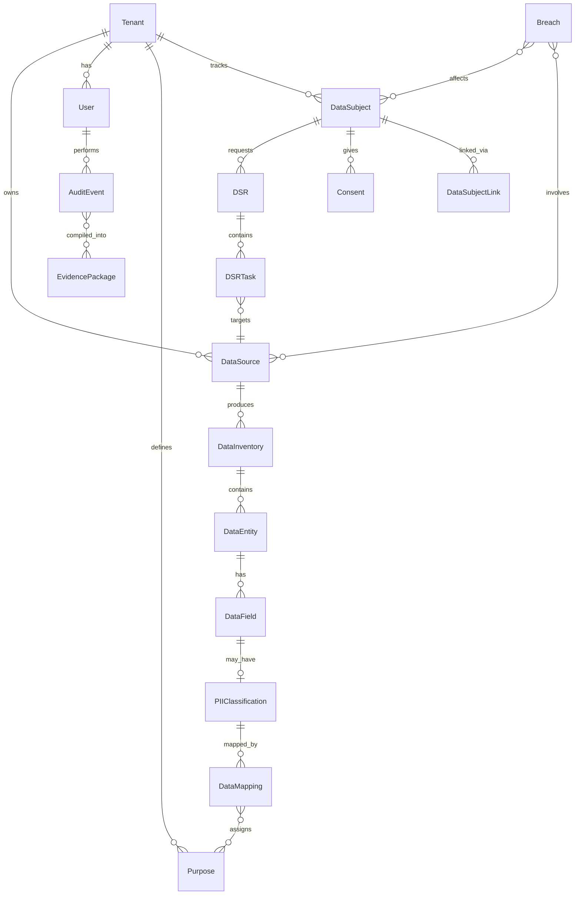

# 21. Domain Model & Bounded Contexts

## Overview

This document defines the core domain model for DataLens 2.0, following Domain-Driven Design (DDD) principles to ensure reusable, regulation-agnostic components.

---

## Bounded Contexts

```
┌─────────────────────────────────────────────────────────────────────────────┐
│                         DATALENS DOMAIN CONTEXTS                             │
├─────────────────────────────────────────────────────────────────────────────┤
│                                                                              │
│  ┌─────────────────┐      ┌─────────────────┐      ┌─────────────────┐     │
│  │   DISCOVERY     │      │   GOVERNANCE    │      │   COMPLIANCE    │     │
│  │   CONTEXT       │ ───► │   CONTEXT       │ ◄─── │   CONTEXT       │     │
│  │                 │      │                 │      │                 │     │
│  │ • Data Sources  │      │ • Policies      │      │ • Regulations   │     │
│  │ • Scans         │      │ • Purposes      │      │ • DSR Requests  │     │
│  │ • PII Detection │      │ • Categories    │      │ • Consents      │     │
│  │ • Data Mapping  │      │ • Retention     │      │ • Breaches      │     │
│  └────────┬────────┘      └────────┬────────┘      └────────┬────────┘     │
│           │                        │                        │               │
│           └────────────────────────┼────────────────────────┘               │
│                                    │                                         │
│                                    ▼                                         │
│                    ┌─────────────────────────────┐                          │
│                    │      EVIDENCE CONTEXT       │                          │
│                    │                             │                          │
│                    │  • Audit Trail              │                          │
│                    │  • Proof Generation         │                          │
│                    │  • Evidence Packages        │                          │
│                    └─────────────────────────────┘                          │
│                                    │                                         │
│           ┌────────────────────────┼────────────────────────┐               │
│           │                        │                        │               │
│  ┌────────▼────────┐      ┌────────▼────────┐      ┌────────▼────────┐     │
│  │   IDENTITY      │      │   NOTIFICATION  │      │   ANALYTICS     │     │
│  │   CONTEXT       │      │   CONTEXT       │      │   CONTEXT       │     │
│  │                 │      │                 │      │                 │     │
│  │ • Users         │      │ • Templates     │      │ • Metrics       │     │
│  │ • Tenants       │      │ • Channels      │      │ • Reports       │     │
│  │ • Roles         │      │ • Schedules     │      │ • Dashboards    │     │
│  │ • Permissions   │      │ • Deliveries    │      │ • Insights      │     │
│  └─────────────────┘      └─────────────────┘      └─────────────────┘     │
│                                                                              │
└─────────────────────────────────────────────────────────────────────────────┘
```

---

## Context 1: Discovery Context

### Purpose
Discover and catalog personal data across all connected data sources.

### Core Entities

```go
// DataSource represents any connected data repository
type DataSource struct {
    ID              UUID
    TenantID        UUID
    Name            string
    Type            DataSourceType   // DATABASE, FILE_SYSTEM, CLOUD_STORAGE, CONTROL CENTRE, EMAIL
    ConnectionInfo  ConnectionInfo   // Encrypted credentials
    Status          ConnectionStatus // CONNECTED, DISCONNECTED, ERROR
    Capabilities    []Capability     // What operations are supported
    LastSyncAt      *time.Time
    CreatedAt       time.Time
    UpdatedAt       time.Time
}

type DataSourceType string
const (
    TypePostgreSQL  DataSourceType = "POSTGRESQL"
    TypeMySQL       DataSourceType = "MYSQL"
    TypeMongoDB     DataSourceType = "MONGODB"
    TypeSnowflake   DataSourceType = "SNOWFLAKE"
    TypeS3          DataSourceType = "S3"
    TypeAzureBlob   DataSourceType = "AZURE_BLOB"
    TypeGoogleDrive DataSourceType = "GOOGLE_DRIVE"
    TypeOneDrive    DataSourceType = "ONEDRIVE"
    TypeSalesforce  DataSourceType = "SALESFORCE"
    TypeIMAP        DataSourceType = "IMAP"
    TypeFileSystem  DataSourceType = "FILE_SYSTEM"
    TypeAPI         DataSourceType = "API"
)
```

```go
// DataInventory represents discovered data structure
type DataInventory struct {
    ID              UUID
    DataSourceID    UUID
    Entities        []DataEntity     // Tables, collections, folders
    TotalFields     int
    PIIFieldsCount  int
    LastScannedAt   time.Time
    SchemaVersion   string           // Track schema changes
}

// DataEntity is a table, collection, file folder, etc.
type DataEntity struct {
    ID              UUID
    InventoryID     UUID
    Name            string
    Schema          string           // Database schema (if applicable)
    Type            EntityType       // TABLE, COLLECTION, FOLDER, FILE
    Fields          []DataField
    RowCount        *int64           // Estimated row count
    PIIConfidence   float64          // Aggregated PII confidence
}

// DataField is a column, property, or data element
type DataField struct {
    ID              UUID
    EntityID        UUID
    Name            string
    DataType        string           // VARCHAR, INTEGER, JSON, etc.
    Nullable        bool
    IsPrimaryKey    bool
    IsForeignKey    bool
    SampleValues    []string         // Encrypted samples for detection
    PIIClassification *PIIClassification
}
```

```go
// PIIClassification is the core reusable PII detection result
type PIIClassification struct {
    ID              UUID
    FieldID         UUID
    Category        PIICategory      // IDENTITY, CONTACT, FINANCIAL, etc.
    Type            PIIType          // NAME, EMAIL, PHONE, AADHAAR, etc.
    Sensitivity     SensitivityLevel // LOW, MEDIUM, HIGH, CRITICAL
    Confidence      float64          // 0.0 to 1.0
    DetectionMethod DetectionMethod  // AI, REGEX, HEURISTIC, MANUAL
    Status          VerificationStatus // PENDING, VERIFIED, REJECTED
    VerifiedBy      *UUID
    VerifiedAt      *time.Time
    Evidence        ClassificationEvidence
}

// Universal PII categories (regulation-agnostic)
type PIICategory string
const (
    CategoryIdentity      PIICategory = "IDENTITY"       // Name, ID numbers
    CategoryContact       PIICategory = "CONTACT"        // Email, phone, address
    CategoryFinancial     PIICategory = "FINANCIAL"      // Bank, credit card
    CategoryHealth        PIICategory = "HEALTH"         // Medical records
    CategoryBiometric     PIICategory = "BIOMETRIC"      // Fingerprint, face
    CategoryGenetic       PIICategory = "GENETIC"        // DNA, genetic data
    CategoryLocation      PIICategory = "LOCATION"       // GPS, addresses
    CategoryBehavioral    PIICategory = "BEHAVIORAL"     // Browsing, preferences
    CategoryProfessional  PIICategory = "PROFESSIONAL"   // Employment, education
    CategoryGovernmentID  PIICategory = "GOVERNMENT_ID"  // SSN, Aadhaar, passport
    CategoryMinor         PIICategory = "MINOR"          // Child data
)

// Specific PII types (extensible)
type PIIType string
const (
    TypeName          PIIType = "NAME"
    TypeEmail         PIIType = "EMAIL"
    TypePhone         PIIType = "PHONE"
    TypeAddress       PIIType = "ADDRESS"
    TypeAadhaar       PIIType = "AADHAAR"
    TypePAN           PIIType = "PAN"
    TypePassport      PIIType = "PASSPORT"
    TypeSSN           PIIType = "SSN"
    TypeNationalID    PIIType = "NATIONAL_ID"
    TypeDOB           PIIType = "DATE_OF_BIRTH"
    TypeGender        PIIType = "GENDER"
    TypeBankAccount   PIIType = "BANK_ACCOUNT"
    TypeCreditCard    PIIType = "CREDIT_CARD"
    TypeIPAddress     PIIType = "IP_ADDRESS"
    TypeMACAddress    PIIType = "MAC_ADDRESS"
    TypeDeviceID      PIIType = "DEVICE_ID"
    TypeBiometric     PIIType = "BIOMETRIC"
    TypeMedicalRecord PIIType = "MEDICAL_RECORD"
    TypePhoto         PIIType = "PHOTO"
    TypeSignature     PIIType = "SIGNATURE"
    // Extensible via configuration
)
```

```go
// ScanRun represents a single scanning operation
type ScanRun struct {
    ID              UUID
    DataSourceID    UUID
    Type            ScanType         // FULL, INCREMENTAL, TARGETED
    Status          ScanStatus       // PENDING, RUNNING, COMPLETED, FAILED
    Progress        int              // 0-100
    StartedAt       *time.Time
    CompletedAt     *time.Time
    Stats           ScanStats
    ErrorMessage    *string
}

type ScanStats struct {
    EntitiesScanned   int
    FieldsScanned     int
    PIIDetected       int
    Duration          time.Duration
    BytesProcessed    int64
}
```

### Domain Services

```go
// DiscoveryService orchestrates data discovery operations
type DiscoveryService interface {
    // Connect a new data source
    ConnectDataSource(ctx context.Context, config DataSourceConfig) (*DataSource, error)
    
    // Trigger a scan
    StartScan(ctx context.Context, dataSourceID UUID, scanType ScanType) (*ScanRun, error)
    
    // Get inventory for a data source
    GetInventory(ctx context.Context, dataSourceID UUID) (*DataInventory, error)
    
    // Verify a PII classification
    VerifyClassification(ctx context.Context, classificationID UUID, decision VerificationDecision) error
}
```

---

## Context 2: Governance Context

### Purpose
Define and manage data governance policies, purposes, and rules.

### Core Entities

```go
// Purpose represents why personal data is collected/processed
type Purpose struct {
    ID              UUID
    TenantID        UUID
    Code            string           // Unique code, e.g., "MARKETING"
    Name            string           // Display name
    Description     string
    LegalBasis      LegalBasis       // CONSENT, CONTRACT, LEGAL_OBLIGATION, etc.
    RetentionDays   int              // Default retention period
    IsActive        bool
    RequiresConsent bool             // Whether explicit consent is needed
    CreatedAt       time.Time
    UpdatedAt       time.Time
}

// Universal legal basis (regulation-agnostic)
type LegalBasis string
const (
    BasisConsent          LegalBasis = "CONSENT"
    BasisContract         LegalBasis = "CONTRACT"
    BasisLegalObligation  LegalBasis = "LEGAL_OBLIGATION"
    BasisVitalInterest    LegalBasis = "VITAL_INTEREST"
    BasisPublicInterest   LegalBasis = "PUBLIC_INTEREST"
    BasisLegitimateInterest LegalBasis = "LEGITIMATE_INTEREST"
    BasisEmployment       LegalBasis = "EMPLOYMENT"  // DPDPA-specific
)
```

```go
// DataMapping links discovered data to governance
type DataMapping struct {
    ID              UUID
    ClassificationID UUID          // Link to PIIClassification
    PurposeIDs      []UUID         // Why this data is collected
    RetentionDays   int            // Override or use purpose default
    ThirdPartyIDs   []UUID         // Who has access
    CrossBorderInfo *CrossBorderTransfer
    Notes           string
    MappedBy        UUID           // User who mapped
    MappedAt        time.Time
}

// CrossBorderTransfer tracks international data flows
type CrossBorderTransfer struct {
    DestinationCountry string
    LegalMechanism     string        // ADEQUACY, SCC, BCR, CONSENT
    DocumentationPath  string        // Link to supporting docs
    ApprovalStatus     ApprovalStatus
}
```

```go
// Policy defines governance rules
type Policy struct {
    ID              UUID
    TenantID        UUID
    Name            string
    Description     string
    Type            PolicyType       // RETENTION, ACCESS, TRANSFER, ALERT
    Rules           []PolicyRule
    Severity        Severity         // INFO, WARNING, CRITICAL
    Actions         []PolicyAction   // ALERT, BLOCK, AUTO_REMEDIATE
    IsActive        bool
    CreatedAt       time.Time
}

type PolicyRule struct {
    ID              UUID
    PolicyID        UUID
    Condition       RuleCondition    // JSON/DSL condition
    Description     string
}

// Example conditions (stored as JSON, evaluated by engine):
// {"field": "pii.category", "operator": "equals", "value": "HEALTH"}
// {"field": "data_mapping.purpose_count", "operator": "equals", "value": 0}
// {"field": "consent.expires_at", "operator": "less_than", "value": "now+30d"}
```

```go
// ThirdParty represents external data processors
type ThirdParty struct {
    ID              UUID
    TenantID        UUID
    Name            string
    Type            ThirdPartyType   // PROCESSOR, CONTROLLER, VENDOR
    Country         string
    DPADocPath      *string          // Data Processing Agreement
    IsActive        bool
    Purposes        []UUID           // What purposes they're authorized for
}
```

---

## Context 3: Compliance Context

### Purpose
Handle compliance-specific requirements: DSR, consent, breaches.

### Core Entities

```go
// DataSubject represents an individual whose data is processed
type DataSubject struct {
    ID              UUID
    TenantID        UUID
    Identifier      string           // Email, phone, or unique ID
    IdentifierType  IdentifierType   // EMAIL, PHONE, CUSTOM
    Metadata        map[string]string // Additional attributes
    FirstSeenAt     time.Time
    LastActivityAt  time.Time
    Status          SubjectStatus    // ACTIVE, DELETED, ANONYMIZED
}

// DataSubjectLink connects subject to discovered data
type DataSubjectLink struct {
    ID              UUID
    SubjectID       UUID
    FieldID         UUID             // Which field contains their data
    DataSourceID    UUID             // Which data source
    DiscoveredAt    time.Time
}
```

```go
// DSR (Data Subject Request) - regulation-agnostic
type DSR struct {
    ID              UUID
    TenantID        UUID
    SubjectID       UUID
    Type            DSRType          // ACCESS, ERASURE, CORRECTION, etc.
    Status          DSRStatus        // PENDING, IN_PROGRESS, COMPLETED, FAILED
    Priority        Priority         // LOW, MEDIUM, HIGH, URGENT
    
    // Request details
    RequestedAt     time.Time
    RequestedBy     Requester        // Who submitted (subject or delegate)
    RequestDetails  DSRDetails       // Type-specific details
    
    // Regulation context
    RegulationRef   string           // "DPDPA", "GDPR", etc.
    Deadline        time.Time        // Auto-computed from regulation
    
    // Processing
    AssignedTo      *UUID            // User handling this
    Tasks           []DSRTask        // Breakdown into actionable tasks
    
    // Completion
    CompletedAt     *time.Time
    CompletionNotes string
    EvidenceID      *UUID            // Link to evidence package
}

type DSRType string
const (
    DSRTypeAccess       DSRType = "ACCESS"
    DSRTypeErasure      DSRType = "ERASURE"
    DSRTypeCorrection   DSRType = "CORRECTION"
    DSRTypePortability  DSRType = "PORTABILITY"
    DSRTypeObjection    DSRType = "OBJECTION"
    DSRTypeRestriction  DSRType = "RESTRICTION"
    DSRTypeNomination   DSRType = "NOMINATION"  // DPDPA-specific
)

// DSRTask is a specific action within a DSR
type DSRTask struct {
    ID              UUID
    DSRID           UUID
    DataSourceID    UUID             // Which data source to act on
    Action          DSRAction        // DELETE, UPDATE, EXPORT, etc.
    TargetFields    []UUID           // Which fields
    Status          TaskStatus
    ExecutedAt      *time.Time
    Result          *TaskResult
    ErrorMessage    *string
}
```

```go
// Consent represents a data subject's permission
type Consent struct {
    ID              UUID
    TenantID        UUID
    SubjectID       UUID
    
    // What they consented to
    PurposeIDs      []UUID
    DataCategories  []PIICategory
    
    // How and when
    GrantedAt       time.Time
    ExpiresAt       *time.Time
    Mechanism       ConsentMechanism // EXPLICIT, IMPLICIT, OPT_IN, OPT_OUT
    
    // Proof
    Proof           ConsentProof     // IP, timestamp, screenshot hash, etc.
    
    // Status
    Status          ConsentStatus    // ACTIVE, WITHDRAWN, EXPIRED
    WithdrawnAt     *time.Time
    WithdrawalReason *string
    
    // Regulation
    RegulationRef   string
}

type ConsentMechanism string
const (
    MechanismExplicit    ConsentMechanism = "EXPLICIT"
    MechanismImplicit    ConsentMechanism = "IMPLICIT"
    MechanismOptIn       ConsentMechanism = "OPT_IN"
    MechanismOptOut      ConsentMechanism = "OPT_OUT"
    MechanismGranular    ConsentMechanism = "GRANULAR"
)

type ConsentProof struct {
    IPAddress       string
    UserAgent       string
    Timestamp       time.Time
    MethodDetails   string           // "Banner click", "Form submission"
    ScreenshotHash  *string          // SHA-256 of consent UI
    Signature       string           // Digital signature
}
```

```go
// Breach represents a data breach incident
type Breach struct {
    ID              UUID
    TenantID        UUID
    
    // Detection
    DetectedAt      time.Time
    DetectedBy      string           // System, user, external
    
    // Classification
    Type            BreachType       // UNAUTHORIZED_ACCESS, DATA_LOSS, etc.
    Severity        Severity
    AffectedRecords *int64
    DataCategories  []PIICategory
    
    // Impact
    AffectedSubjects []UUID
    AffectedSources  []UUID
    
    // Response
    Status          BreachStatus     // DETECTED, INVESTIGATING, CONTAINED, RESOLVED
    ContainedAt     *time.Time
    ResolvedAt      *time.Time
    
    // Notifications (regulation-driven)
    AuthorityNotified     *time.Time
    SubjectsNotified      *time.Time
    AuthorityNotificationRef string
    
    // Evidence
    RootCauseAnalysis     string
    RemediationActions    string
    EvidenceID            *UUID
}
```

```go
// Grievance represents a complaint from a data subject
type Grievance struct {
    ID              UUID
    TenantID        UUID
    SubjectID       *UUID            // May be anonymous
    
    // Complaint details
    Type            GrievanceType    // CONSENT, DATA_ACCURACY, BREACH, OTHER
    Description     string
    ReceivedAt      time.Time
    ReceivedVia     string           // EMAIL, PORTAL, PHONE
    
    // Processing
    Status          GrievanceStatus
    AssignedTo      *UUID
    Response        *string
    ResolvedAt      *time.Time
    
    // SLA
    Deadline        time.Time
    RegulationRef   string
}
```

---

## Context 4: Evidence Context

### Purpose
Generate and maintain immutable, legally admissible evidence.

### Core Entities

```go
// AuditEvent captures every significant action
type AuditEvent struct {
    ID              UUID
    TenantID        UUID
    EventType       string           // e.g., "consent.granted", "dsr.completed"
    
    // Who
    ActorID         UUID
    ActorType       ActorType        // USER, SYSTEM, API, AGENT
    
    // What
    ResourceType    string           // DSR, CONSENT, PII_CLASSIFICATION, etc.
    ResourceID      UUID
    Action          string           // CREATE, UPDATE, DELETE, EXECUTE
    
    // Details
    Before          *json.RawMessage // State before (for changes)
    After           *json.RawMessage // State after (for changes)
    Metadata        map[string]any
    
    // When
    Timestamp       time.Time
    
    // Integrity
    PreviousHash    string           // Chain to previous event
    Hash            string           // SHA-256 of this event
    Signature       string           // Digital signature
}
```

```go
// EvidencePackage is a compiled proof bundle
type EvidencePackage struct {
    ID              UUID
    TenantID        UUID
    Type            EvidenceType     // DSR_COMPLETION, CONSENT_PROOF, BREACH_RESPONSE
    
    // Content
    Events          []UUID           // Related audit events
    Documents       []Document       // Supporting documents
    Summary         string           // Human-readable summary
    
    // Metadata
    GeneratedAt     time.Time
    GeneratedFor    string           // "DSR-12345", "Audit-2024"
    ExpiresAt       *time.Time
    
    // Integrity
    Hash            string           // SHA-256 of entire package
    Signature       string           // Digital signature
    
    // Storage
    StoragePath     string           // Path in object storage
}
```

---

## Context 5: Identity Context

### Purpose
Manage users, tenants, authentication, and authorization.

### Core Entities

```go
// Tenant represents an organization using DataLens
type Tenant struct {
    ID              UUID
    Name            string
    Domain          string           // Company domain
    Industry        string           // For sector templates
    Country         string           // Primary jurisdiction
    Plan            PlanType         // FREE, STARTER, PROFESSIONAL, ENTERPRISE
    Status          TenantStatus     // ACTIVE, SUSPENDED, DELETED
    Settings        TenantSettings
    CreatedAt       time.Time
}

type TenantSettings struct {
    DefaultRegulation   string       // Primary regulation
    EnabledRegulations  []string     // All applicable regulations
    RetentionDays       int          // Default data retention
    EnableAI            bool         // Use AI features
    AIProvider          string       // OPENAI, ANTHROPIC, LOCAL
    WhiteLabelSettings  *WhiteLabel  // Custom branding
}
```

```go
// User represents a platform user
type User struct {
    ID              UUID
    TenantID        UUID
    Email           string
    Name            string
    Status          UserStatus       // ACTIVE, INVITED, SUSPENDED
    Roles           []UUID           // Assigned roles
    MFAEnabled      bool
    LastLoginAt     *time.Time
    CreatedAt       time.Time
}

// Role defines a set of permissions
type Role struct {
    ID              UUID
    TenantID        *UUID            // nil = system role
    Name            string           // ADMIN, DPO, ANALYST, VIEWER
    Permissions     []Permission
    IsSystem        bool             // Cannot be modified if true
}

type Permission struct {
    Resource        string           // DSR, CONSENT, PII, SETTINGS
    Actions         []string         // READ, WRITE, DELETE, VERIFY
}
```

---

## Cross-Context Relationships



---

## Value Objects

```go
// Reusable value objects (immutable, no identity)

type DateRange struct {
    Start   time.Time
    End     time.Time
}

type GeoLocation struct {
    Country    string
    Region     string
    City       string
    Latitude   float64
    Longitude  float64
}

type ContactInfo struct {
    Email   string
    Phone   string
    Address string
}

type Money struct {
    Amount   decimal.Decimal
    Currency string
}

type Metadata map[string]interface{}
```

---

## Aggregates

| Aggregate Root | Entities in Aggregate | Consistency Boundary |
|----------------|----------------------|----------------------|
| **DataSource** | DataInventory, DataEntity, DataField, ScanRun | Single data source operations |
| **DataSubject** | DSR, Consent, DataSubjectLink, Grievance | Single subject's data rights |
| **Breach** | BreachNotification, RemediationAction | Single incident lifecycle |
| **Tenant** | Users, Roles, Settings | Organization configuration |
| **EvidencePackage** | AuditEvents, Documents | Compiled evidence bundle |

---

## Repository Interfaces

```go
// Each aggregate has a repository
type DataSourceRepository interface {
    Create(ctx context.Context, ds *DataSource) error
    GetByID(ctx context.Context, id UUID) (*DataSource, error)
    GetByTenant(ctx context.Context, tenantID UUID) ([]DataSource, error)
    Update(ctx context.Context, ds *DataSource) error
    Delete(ctx context.Context, id UUID) error
}

type DataSubjectRepository interface {
    Create(ctx context.Context, ds *DataSubject) error
    GetByID(ctx context.Context, id UUID) (*DataSubject, error)
    FindByIdentifier(ctx context.Context, tenantID UUID, identifier string) (*DataSubject, error)
    GetDSRs(ctx context.Context, subjectID UUID) ([]DSR, error)
    GetConsents(ctx context.Context, subjectID UUID) ([]Consent, error)
}

type DSRRepository interface {
    Create(ctx context.Context, dsr *DSR) error
    GetByID(ctx context.Context, id UUID) (*DSR, error)
    GetPending(ctx context.Context, tenantID UUID) ([]DSR, error)
    GetOverdue(ctx context.Context, tenantID UUID) ([]DSR, error)
    Update(ctx context.Context, dsr *DSR) error
}

// ... similar for other aggregates
```

---

## Next Document

➡️ See [22_AI_Integration_Strategy.md](./22_AI_Integration_Strategy.md) for AI patterns and integration strategy.
